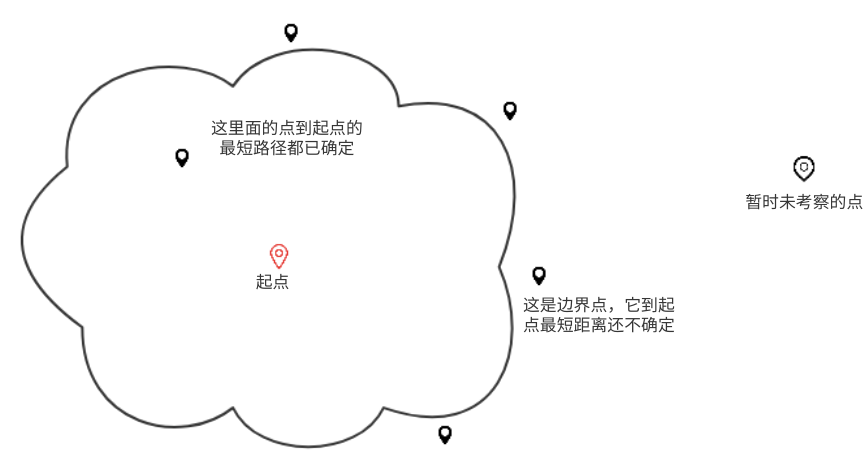

## 1. Dijkstra最短路径算法 ##

Dijkstra最短路径算法可以用于在图中查找从某一点出发，到另外一个点距离最短的路径。

它的核心思想是，**以起始点为中心，逐步确定外围的点到它的最短路径，向外层层推进直到覆盖到目标点**，或者全图搜索完毕仍未找到终点（此时每个点到起点的最短路径均被计算出来）

算法思路：

- 为了方便，将图中n个点分别记为1,2,3,...,n。
- 为了描述方便，将一个点到起点的最短距离简单称为该点的最短距离。
- 数组`Dis`保存每个点的最短距离。 
- 数组`Bound`保存当前正在考察的边界点。边界以内的所有点都已经确定了最短距离。

1. 先将数组`Dis`的所有元素初始化为`INF`（无穷大）。将每个点标记为`未确认`状态。
2. `Dis(s)`设值为0，将`s`添加到`Bound`数组待考察。
3. 从`Bound`数组<u>取出</u>目前距起点最近的点`m`，将该点标记为`已确认`状态。
4. 检查`m`是否为终点。如果是则退出当前算法，输出最短路径；否则进入下一步。
5. 将`m`点相邻的所有`未确认`的点放入`Bound`数组，并更新这些点的最短距离（即是否经过`m`到这些点最短距离更小）。
6. 如果`Bound`数组为空，则退出该算法，终点不在图内；否则，回到步骤3.

